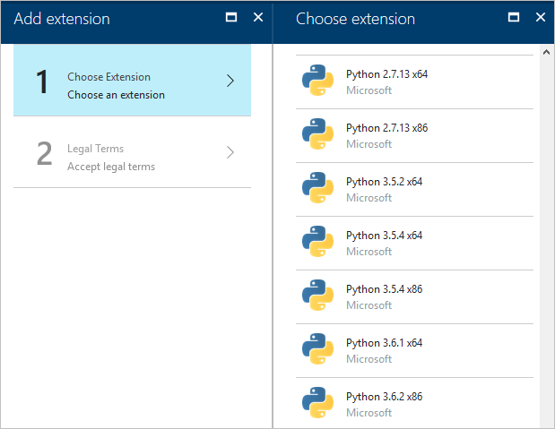
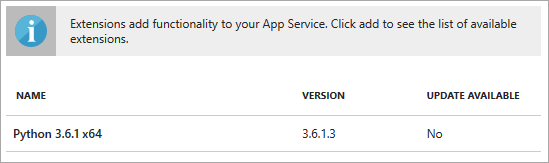
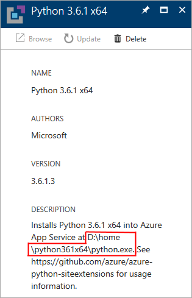

# Managing Python on Azure App Service
Based off:
https://github.com/MicrosoftDocs/visualstudio-docs/blob/master/docs/python/managing-python-on-azure-app-service.md

## Choose a Python version through the Azure portal

1. Create an App Service for your web app on the Azure portal.
1. On the App Service's page, scroll to the **Development Tools** section, select **Extensions**, then select **+ Add**.
1. Scroll down in the list to the extension that contains the version of Python you want:

    

    > [!Tip]
    > If you need an older version of Python and don't see it listed in the site extensions, you can still install it through the Azure Resource Manager as described in the next section.

1. Select the extension, accept the legal terms, then select **OK**.
1. A notification appears in the portal when installation is complete.

## Choose a Python version through the Azure Resource Manager

If you are deploying an App Service with an Azure Resource Manager template, add the site extension as a resource. Specifically, the extension appears as a nested resource (a `resources` object under `resources`) with the type `siteextensions` and the name from [siteextensions.net](https://www.siteextensions.net/packages?q=Tags%3A%22python%22).

For example, after adding a reference to `python361x64` (Python 3.6.1 x64), your template may look like the following (some properties omitted):

```json
"resources": [
  {
    "apiVersion": "2015-08-01",
    "name": "[parameters('siteName')]",
    "type": "Microsoft.Web/sites",

    // ...

    "resources": [
      {
        "apiVersion": "2015-08-01",
        "name": "python361x64",
        "type": "siteextensions",
        "properties": { },
        "dependsOn": [
          "[resourceId('Microsoft.Web/sites', parameters('siteName'))]"
        ]
      },
      // ...
    ]
  }
```

## Set web.config to point to the Python interpreter

After installing the site extension (through either the portal or an Azure Resource Manager template), you next point your app's *web.config* file to the Python interpreter. The *web.config* file instructs the IIS (7+) web server running on App Service about how it should handle Python requests through either FastCGI or HttpPlatform.

Begin by finding the full path to the site extension's *python.exe*, then create and modify the appropriate *web.config* file.

### Find the path to python.exe

A Python site extension is installed on the server under *d:\home* in a folder appropriate to the Python version and architecture (except in the case of a few older versions). For example, Python 3.6.1 x64 is installed in *d:\home\python361x64*. The full path to the Python interpreter is then *d:\home\python361x64\python.exe*.

To see the specific path on your App Service, select **Extensions** on the App Service page, then select the extension in the list.



This action opens the extension's description page containing the path:



If you have trouble seeing the path for the extension, you can find it manually using the console:

1. On your App Service page, select the **Development Tools** > **Console**.
1. Enter the command `ls ../home` or `dir ..\home` to see the top-level extensions folders, such as *Python361x64*.
1. Enter a command like `ls ../home/python361x64` or `dir ..\home\python361x64` to verify that it contains *python.exe* and other interpreter files.
